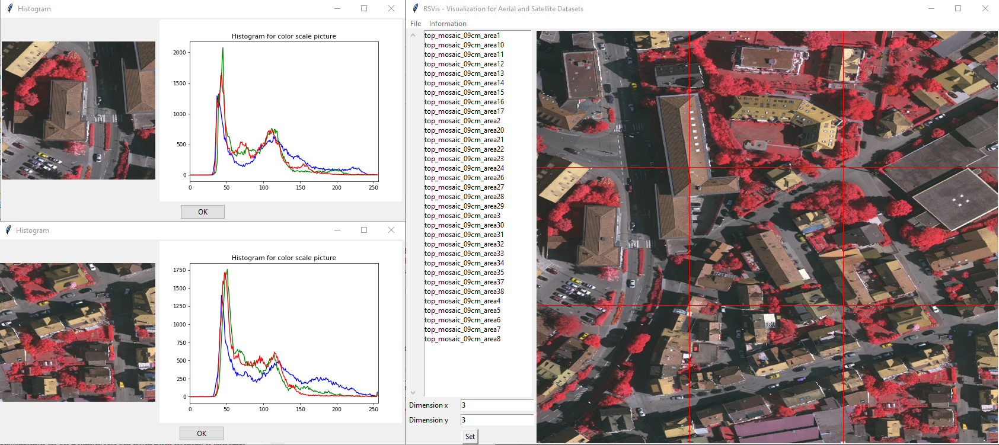

# README

## Install

If `git` is installed on your personal computer, start a virtual environment in `python` and run the following installation command

```PowerShell
pip install -e git+http://github.com/wbrandenburger/DataVisualization.git#egg=rsvis
```

Otherwise, download the source code of the repository to an arbitrary path and install the package via

```PowerShell
pip install -e git+file:///path/to/your/git/repo#egg=rsvis
```

or

```PowerShell
python path/to/your/git/repo/setup.py install develop
```

## Run RSVis

Start the virtual environment in python where the data visualization package is located and navigate to the main folder with the dataset of the lecture and run the following command

```PowerShell
rsvis run "lecture.yaml" --task_set tasks --task rsshow
```

The path of key `param_io` in `lecture.yaml` has to point to an existing path, where displayed images can be saved.


