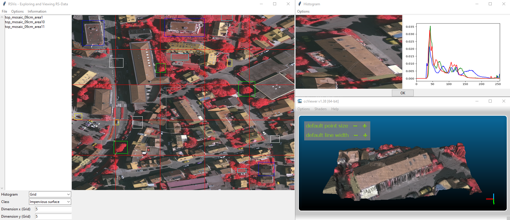

# README

RSVis is a visualization tool for exploring and for viewing remote sensing data.

## Repository

The source code can be found under the following [link](https://github.com/wbrandenburger/DataVisualization).

## Requirements

- Python 3.7.x

- Git (optional)
- CloudCompare (optional)

## Install

If `git` is installed on your personal computer, start a virtual environment in `python` and run the following installation command

```PowerShell
pip install -e git+http://github.com/wbrandenburger/DataVisualization.git#egg=rsvis
```

Otherwise, download the source code of the repository to an arbitrary path and install the package via

```PowerShell
pip install -e git+file:///path/to/your/git/repo#egg=rsvis
```

or

```PowerShell
python path/to/your/git/repo/setup.py install develop
```

## Run RSVis

Start the virtual environment in python where the data visualization package is located and navigate to the main folder with the dataset of the lecture and run the following command

```PowerShell
rsvis run "lecture.yaml" --task_set tasks --task lecture
```

The field `path_dir` of keys `param_in>object` and `param_out>image` in `lecture.yaml` has to point to an existing path, where displayed images and the meta data of annotated objects can be saved. The other parameter of the key are not relevant for the user. If images have to be saved under Windows in folder `C:\User\Username\RSVis` the key `param_io` might be defined as follows:

```yaml
param_io:
  path_dir: C:/User/Username/RSVis
  path_name: '{}'
  regex:
  - .*
  - 0
  ext: .tif
```

## CloudCompare

If the use of CloudCompare is desired, the fields `opener>viewer` and `opener>editor` of key `param_cloud` in `lecture-cloud.yaml` have to point to the executables of `ccViewer` and `CloudCompare`, for example:

```yaml
param_cloud:
  cloud_viewer: "C:/Program Files/ccViewer/ccViewer.exe",
  cloud_editor: "C:/Program Files/CloudCompare/CloudCompare.exe",
```

Additionally, the field `path_dir` of key `param_cloud>temp` has to point to an existing path, where pointclouds an meshes can be saved.

Since, the use of CloudCompare is not activated by default, the command to execute `RSVis` changes to:

```PowerShell
rsvis run "lecture-cloud.yaml" --task_set tasks --task rsshow
```



## Acknowledgement

The Vaihingen data set was provided by the German Society for Photogrammetry, Remote Sensing and Geoinformation (DGPF) [Cramer, 2010](http://www.ifp.uni-stuttgart.de/dgpf/DKEP-Allg.htm)

## References

[1]: Cramer, M., 2010. The DGPF test on digital aerial camera evaluation – overview and test design. Photogrammetrie – Fernerkundung – Geoinformation 2(2010): 73-82.
